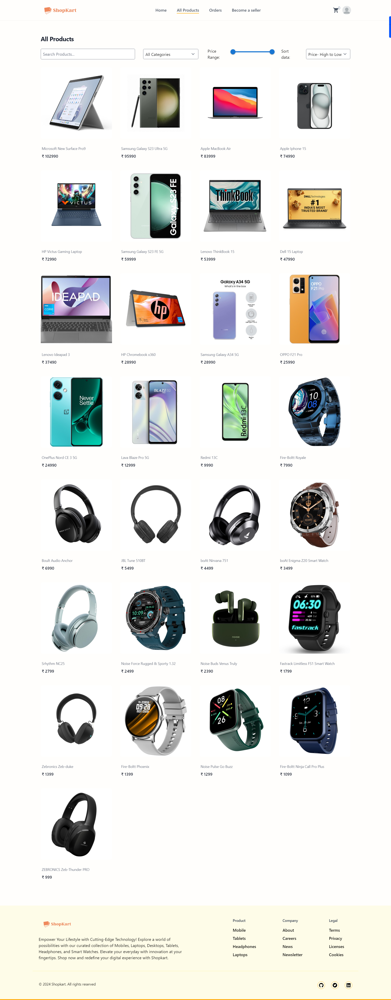

# Shopkart - Ecommerce App

Explore the Shopkart Ecommerce App [here](https://shopkart-ecommerce-app.netlify.app/).

## Overview

Shopkart is a comprehensive full-stack eCommerce application crafted with MERN (MongoDB, Express.js, React, and Node.js) technology. Offering secure access control through JWT tokens, the application encompasses various features and pages to deliver a seamless shopping experience.

## Tech Stack Used

### Backend (Server)
- **Node.js:** JavaScript runtime for server-side development.
- **Express.js:** Web application framework for building robust APIs.
- **MongoDB:** NoSQL database for efficient and scalable data storage.
- **Mongoose:** ODM (Object Data Modeling) library for MongoDB and Node.js.
- **bcrypt:** Library for hashing passwords securely.
- **jsonwebtoken:** Enables secure authentication through JSON Web Tokens.
- **stripe:** Integration for secure online payment processing.

### Frontend (Client)
- **React:** JavaScript library for building user interfaces.
- **Tailwind CSS:** Utility-first CSS framework for styling.
- **Redux Toolkit:** State management library for predictable state containers.
- **axios:** Promise-based HTTP client for making API requests.
- **react-router-dom:** Routing library for navigation within the React application.
- **jwt-decode:** Library for decoding JWTs on the client-side.
- **react-hot-toast:** Toast notifications for React applications.

### Key Features

1. **User Authentication:** Employing JWT tokens to ensure secure access control.

2. **Home Page:**
   - A visually appealing landing page featuring top products available on Shopkart.
   - Navigation bar facilitates easy exploration across different sections.
   - Utilizes react-slick and swiper libraries for pagination and carousel effects.

   

3. **All Products Page:**
   - Displays a comprehensive list of all products within the system.
   - Search bar enables users to filter products by category, name, or price range using a slider.
   - Each product card provides essential details such as name, price, and images.

   

4. **Product Details Page:**
   - Offers detailed information about a selected product, including description, price, and category.
   - Users can view product images, ratings, and reviews.
   - Sellers can manage their product through options for deletion and updates.
   - Option to add the product to the cart is available, along with suggestions for similar products.

   

5. **Cart:**
   - A shopping cart icon in the Navbar indicates the number of items added.
   - Allows users to manage cart items, adjust quantities, and view the total cost.
   - Option to empty the cart is also provided.

   

6. **Checkout Page:**
   - Displays information on items in the cart.
   - Prompts users for shipping address and redirects to Stripe Payment Gateway for secure transactions.

   

7. **Stripe Payment Gateway:**
   - Secure payment processing through Stripe.
   - Users enter card details for transactions, and successful payments redirect back to the Shopkart homepage.

   

8. **Orders Page:**
   - Provides an overview of user orders, including product details, dates, and addresses.
   - Users can rate and review products, influencing the product details page.

   

9. **Profile Page:**
   - Displays user information, including name, email, phone number, address, and profile picture.
   - Option to update profile information.

   

10. **Update Profile Page:**
    - Enables users to modify their profile details, including name, email, phone number, address, and profile picture.

    

11. **Become A Seller Page:**
    - Guides users through the process of becoming a seller, including terms and conditions acceptance.

    

## Seller Routes

Protected routes accessible only to users with the "seller" or "admin" role.

### Add Product Page:

   - Sellers can add their products using a form, providing essential details.
   - Images can be uploaded in jpeg or png format.
   - Successful submission redirects to the home page.

   

### Update Product Page:

   - Sellers can update product information using a dedicated form.

   

### Delete Option:

   - Exclusively visible to the product's seller, allowing deletion with a confirmation popup.

   

## Admin Dashboard

Accessible only to the admin, this dashboard includes:

### All Users:

   - Lists all registered customers and sellers with detailed information.
   - Admin can edit user information or delete users.

   

### All Products:

   - Displays a comprehensive list of all products.
   - Admin can edit product information or delete any product.

   

### All Applications:

   - Lists users seeking to become sellers.
   - Admin can accept or reject applications, determining the user's role as a seller or customer.

 - 